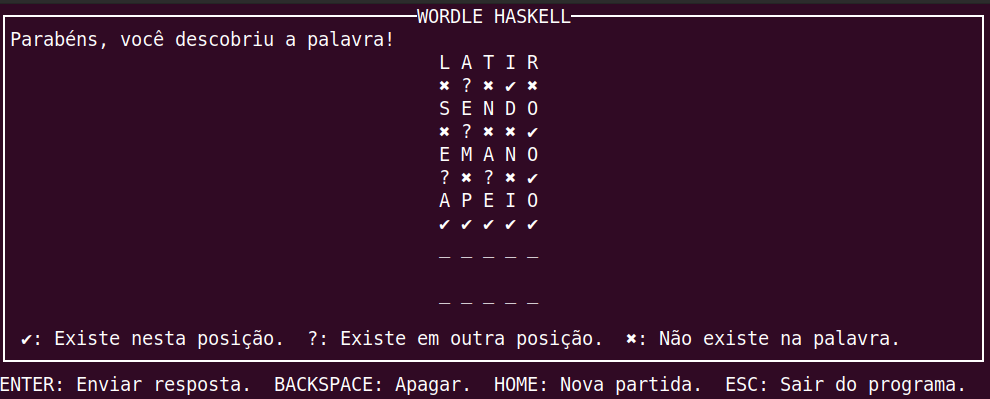

# Wordle in Haskell

This project is a purely functional implementation in Haskell of a portuguese version of the game <a href="https://www.nytimes.com/games/wordle/index.html">Wordle</a>  (also known in Brazil as <a href='https://term.ooo/'>Termo</a> or <a href='https://www.gabtoschi.com/letreco/'>Letreco</a>). Players have six attempts to guess a five-letter word. After each attempt, they receive feedback on each character of their attempt on weather it matchs the corresponding position on the solution. 

Therefore, the following requirements were established and implemented:

* Have a large vocabulary of words in portuguese to randomly sample from on each match. The words chosen were all with length of 5 from https://www.ime.usp.br/~pf/dicios/br-sem-acentos.txt
* Recognize when a user got the word right (won the game), got it wrong , or lost (there were no more attempts left)
* Visual feedback on key errors(incomplete word, incorrect word, invalid word (attempt is a word that does not exist in the vocabulary) and game over
* Visual feedback of each character of the attempted word
* Terminal interaction, allowing the user to restart the match (different from Wordle that is only one word a day)

### How to run?

> stack run
